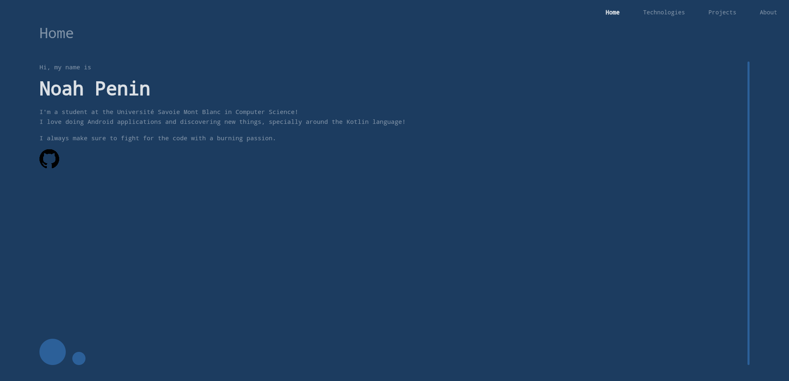
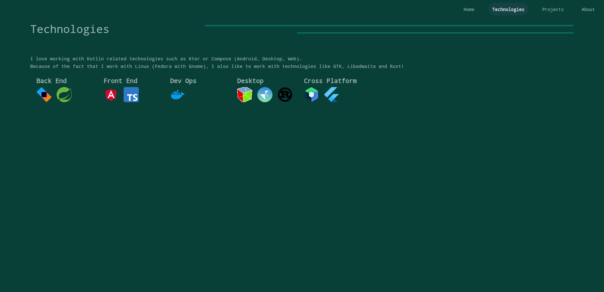
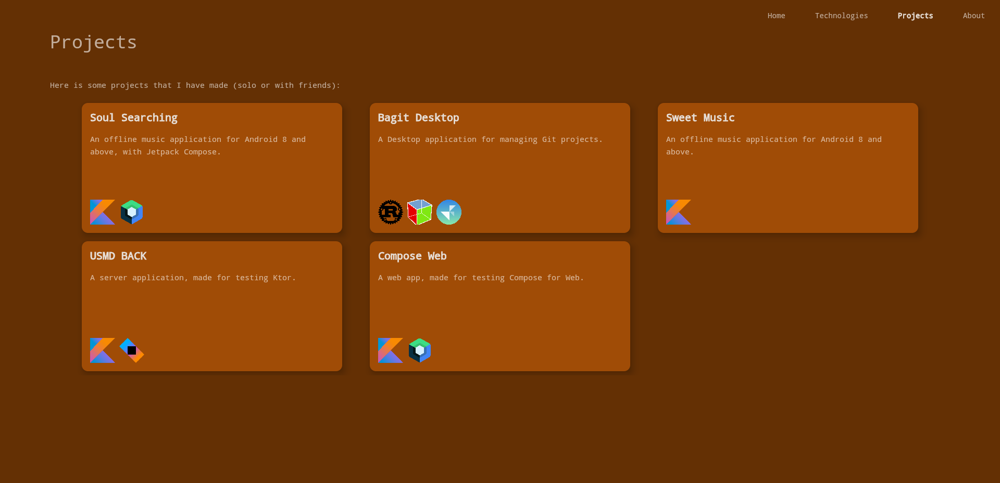
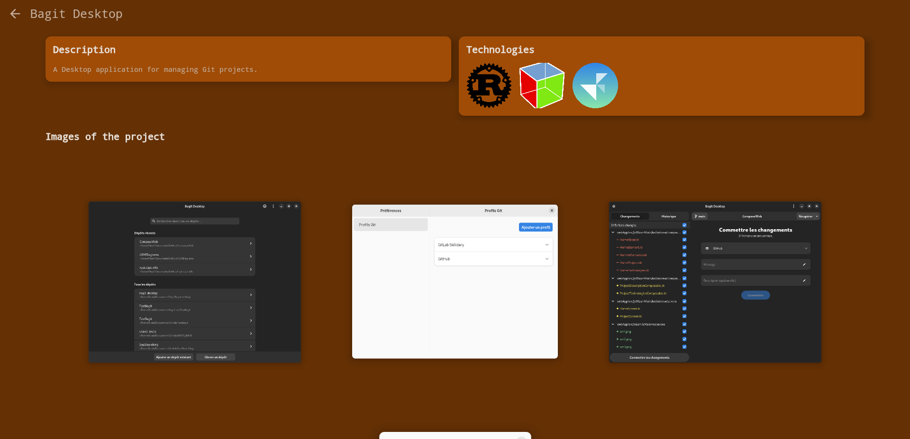
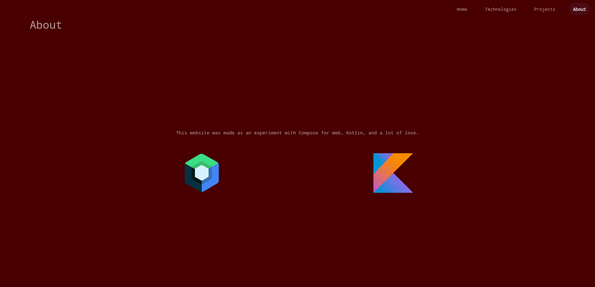

# Compose Multiplatform for Web

> **Note**
> Web support is Experimental and may be changed at any time. Use it only for evaluation purposes.
> We would appreciate your feedback on it in the public Slack channel [#compose-web](https://slack-chats.kotlinlang.org/c/compose-web).
> If you face any issues, please report them on [GitHub](https://github.com/JetBrains/compose-multiplatform/issues).

You can experiment with sharing your mobile or desktop UIs with the web. Compose for Web is based on [Kotlin/Wasm](https://kotl.in/wasm),
the newest target for Kotlin Multiplatform projects. It allows Kotlin developers to run their code in the browser with
all the benefits that WebAssembly has to offer, such as good and predictable performance for your applications.

# Compose Web

This project is an experiment with Compose for Web.

The site made with it represents elements about me as a programmer.

A deployed version of it can be found [here](https://enteraname74.github.io/ComposeWeb/).

    

## Build and run

Check out the repo, navigate to the project folder, and use the following commands:

### Run Web version via Gradle

`./gradlew :webApp:wasmJsRun`

## Setup Environment

To run applications built with Kotlin/Wasm in a browser, you need a browser supporting [wasm garbage collection feature](https://github.com/WebAssembly/gc):

- For **Chrome** and **Chromium-based** browsers (Edge, Brave etc.), it **should just work** since version 119.
- For **Firefox** 120 it **should just work**.
- For **Firefox** 119:
  1. Open `about:config` in the browser.
  2. Enable **javascript.options.wasm_gc**.
  3. Refresh the page.

For more information see https://kotl.in/wasm_help/.

## IDE

We recommend using [IntelliJ IDEA 2023.1 or newer](https://www.jetbrains.com/idea/) to work with the project.

## Known issues

The experience is quite limited on mobile because scrollable elements don't work on mobile devices yet. [See the related issue on compose multiplatform repository.](https://github.com/JetBrains/compose-multiplatform/issues/3491)

# Learn more

* [Compose Multiplatform](https://github.com/JetBrains/compose-multiplatform/#compose-multiplatform)
* [Kotlin/Wasm](https://kotl.in/wasm/)
* [Other examples](../../../#examples)
